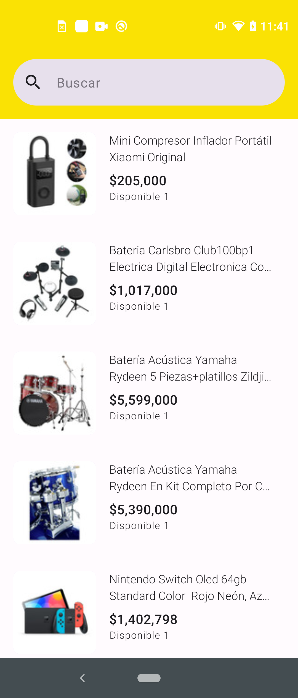

# Mercadolibre - Android APP

Esta es una aplicación en Android que muestra la lista de los productos con el detalle del item 
seleccionado. Esta desarrollada en lenguaje Kotlin y Jetpack compose 

- Buscador de productos
- Muestra lista de los items encontrados
- Muestra el detalle del item seleccionado
- Paginación para cargar mas resultados
- Test unitarios 

```bash
git clone https://github.com/chrisk93/admmeli.git
```

## Screenshots
[](assets/video.mp4)


